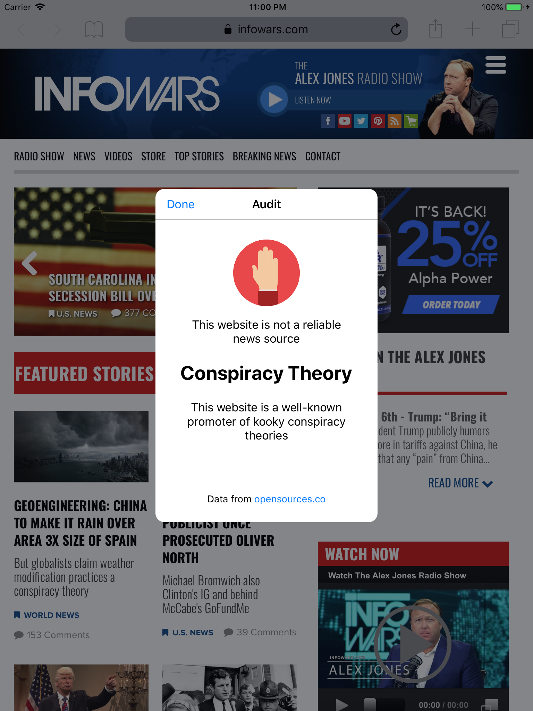

# Audit

    

## What does this app do?

Audit is an app to check whether the website you're browsing promotes credible, misleading or outright fake news.

## How does this app work?

Audit checks the website you're browsing against an open-source and trusted database of news sources, called OpenSources, which are categorised into various types such as Fake News, Conspiracy Theory, Satire, Bias, Junk Science and more.

Audit works completely offline as it stores a copy of the news source database locally and all processing takes place on your device. No information about the websites are sent to an external server.

## Screenshots

</img> </img> </img> 

## How do I use this app?

It's very simple - Just turn on the Audit extension in Safari! Whenever you want to check a news source's credibility, simply use the extension (Share button -> select Audit) and it will provide the results.

## Build requirements

* iOS 10+ SDK
* Xcode 9+
* Swift 4+
* Cocoapods

## Runtime requirements

* iOS 10+
* iPhone or iPad
